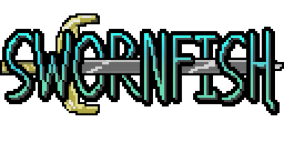
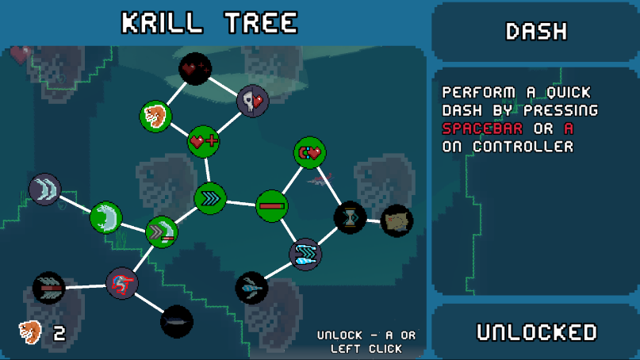
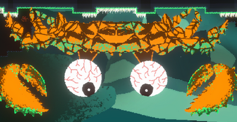
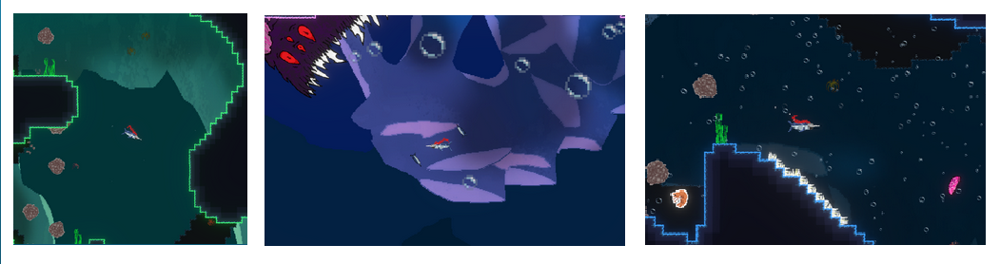
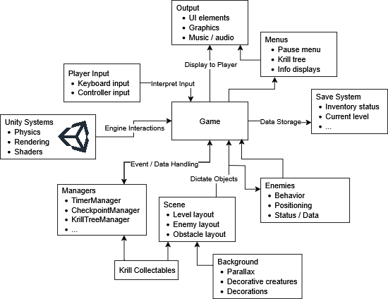

# Description
Swornfish is a game created for EECS494 as a final project using Unity and C#. In the game, you play as a swordfish collecting krill to unlock power-ups, fighting powerful enemies, and discovering new locations.

# Table of Contents
1. [Description](#description)
2. [Table of Contents](#table-of-contents)
3. [Installation Instructions](#installation-instructions)
4. [Feature List](#feature-list)
5. [Architecture Diagram](#architecture-diagram)
6. [Usage Examples](#usage-examples)
7. [Frequently Asked Questions (FAQ)](#frequently-asked-questions-faq)
8. [Credits](#credits)

# Installation Instructions
## Pre-Built Version
Go to [Swornfish's itch.io page](https://rhansen3.itch.io/swornfish) to play the game on the web or to install the game for Windows or Mac.
## Source Code
1. Clone the repo and add the source code as a project in Unity Hub
2. Open the project with Unity Editor 6000.0.33f1
3. Go to File > Build Profiles
4. Select your preferred build platform and hit "Build and Run"

# Feature List
- Player progression

    - Krill tree
        - Players can use their collected krill to unlock abilities in the Krill Tree, giving their character new abilities and features to help their progress.
    - Save system
        - Players can travel anywhere they want in the world and even exit and relaunch the game without worrying about losing their progress.
- Wide variety of enemies

    - Common enemies
        - Different levels have different kinds of enemies for the player to discover and overcome.
    - Bosses
        - Players will find themselves facing off against powerful enemies at the end of certain levels to test their abilities.
- Several different levels

    - 5 different levels to explore
        - Levels contain a variety of themed elements and distinguishing features which make them fun and interesting to explore.
    - Collectable krill
        - Krill are hidden around the game as rewards for defeating powerful enemies or exploring thoroughly
    - Different obstacles to overcome
        - Different levels have lots of non-combat obstacles to keep their player engaged and interested in the world of the game.

# Architecture Diagram

# Usage Examples

Pictured above: One of the boss fights of the game, where the player fights a giant crab in a small arena.

Pictured above: Another boss fight in the game, where the player is dodging the attacks of one of the game's bosses, waiting for their chance to attack.

# Frequently Asked Questions (FAQ)
- Q: How does the save system work?
    - A: The save system works by formatting a .json file to a string and storing it within Unity's PlayerPrefs storage. It updates whenever you reach a checkpoint and stores all relevant information about the game state.

- Q: What game engine was the game made in?
    - A: The game uses Unity 6000.0.33f1 and C#

- Q: How can I contribute to the project?
    - A: Development on the game is currently inactive and is not planned to continue, but should the development team decide to resume work on the project, this page will be updated accordingly.

- Q: I found a bug, how can I tell the developers?
    - A: Please leave a post on the itch.io page describing the bug and we will look into it when we have the time.

# Credits
- Seth Blake
- Ryder Hansen
- Aidan McKiernan
- Juan Flores
- Jiangpeng Li
- Alexander Scott - Additional music
- Maverick Bates - Trailer voice acting
- Other assets used found in downloads
